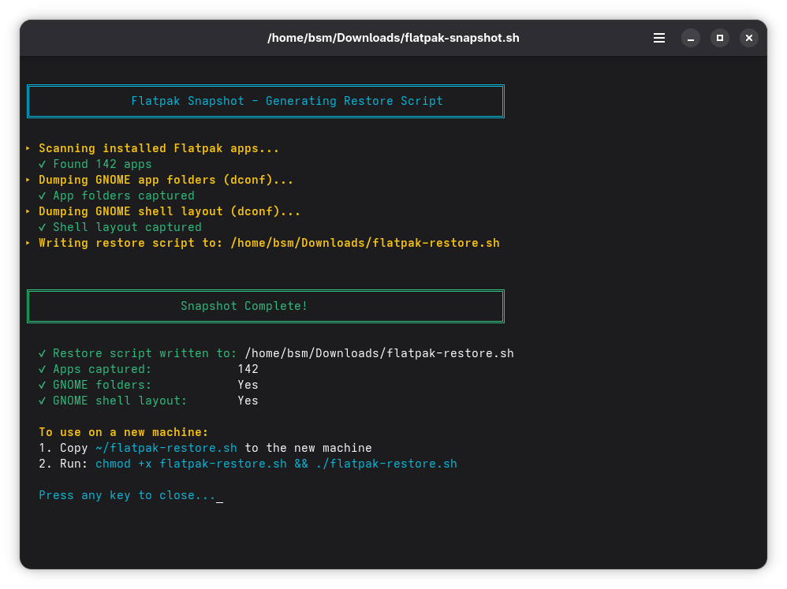

# 🐧 Flatpak Snapshot & Restore for Fedora

A two-script system to **snapshot your current Flatpak app installs and GNOME app grid layout**, then **fully restore everything on a new machine** with a single command.

Built for Fedora + GNOME but should work on any GNOME-based Linux distro using Flatpak.



---

## 📦 What It Does

### `flatpak-snapshot.sh` — Run on your current machine
- Scans all installed Flatpak apps
- Dumps your GNOME app folder layout (those nice organized folders in the app grid)
- Dumps your GNOME shell grid order
- Generates a ready-to-use `flatpak-restore.sh` right next to itself

### `flatpak-restore.sh` — Run on a new machine
- Adds Flathub if not already present
- Installs all your apps (skips already-installed ones safely)
- Applies Flatpak sandbox overrides (external drive access for browsers, Nautilus previewer, etc.)
- Restores your GNOME app folders and grid layout exactly as they were
- Restarts GNOME Shell to apply the layout

---

## 🚀 Quick Start

### Step 1 — On your current machine, take a snapshot

```bash
chmod +x flatpak-snapshot.sh
./flatpak-snapshot.sh
```

This generates `flatpak-restore.sh` in the same folder.

### Step 2 — On a new machine, run the restore

Copy `flatpak-restore.sh` to the new machine, then:

```bash
chmod +x flatpak-restore.sh
./flatpak-restore.sh
```

That's it. All apps install, all folders and grid order restore automatically.

---

## 🔄 Keeping It Current

Any time you install new apps or rearrange your GNOME folders, just re-run the snapshot:

```bash
./flatpak-snapshot.sh
```

It regenerates `flatpak-restore.sh` fresh with your current state. Commit the new restore script to your own fork to keep a versioned backup.

---

## 🔒 Sandbox Overrides Included

The restore script automatically re-applies these known Flatpak sandbox fixes:

| App | Fix Applied |
|-----|-------------|
| `com.google.Chrome` | `/run/media` + `/media` filesystem access |
| `com.brave.Browser` | `/run/media` + `/media` filesystem access |
| `org.mozilla.firefox` | `/run/media` + `/media` filesystem access |
| `org.gnome.NautilusPreviewer` | `/run/media` filesystem access |

> These fix the common issue where Flatpak-sandboxed browsers and the Nautilus file previewer (gnome-sushi) can't access external drives on Fedora.

To add your own overrides, edit the overrides section in `flatpak-snapshot.sh` before running it.

---

## 🗂 File Structure

```
flatpak-snapshot.sh     ← Run this to generate/update the restore script
flatpak-restore.sh      ← Auto-generated — copy this to new machines
README.md
```

---

## ⚙️ Requirements

- Fedora (or any GNOME-based Linux distro)
- `flatpak` installed
- `dconf` installed (included by default on GNOME)
- Flathub will be added automatically if missing

---

## 🤝 Contributing

Pull requests welcome! If you have common sandbox override fixes for other apps, feel free to add them.

---

## 👨‍💻 Developer

**BrainScanMedia.com, Inc.** — https://www.brainscanmedia.com

---

## 📄 License

MIT — © BrainScanMedia.com, Inc. — free to use, modify, and share.
